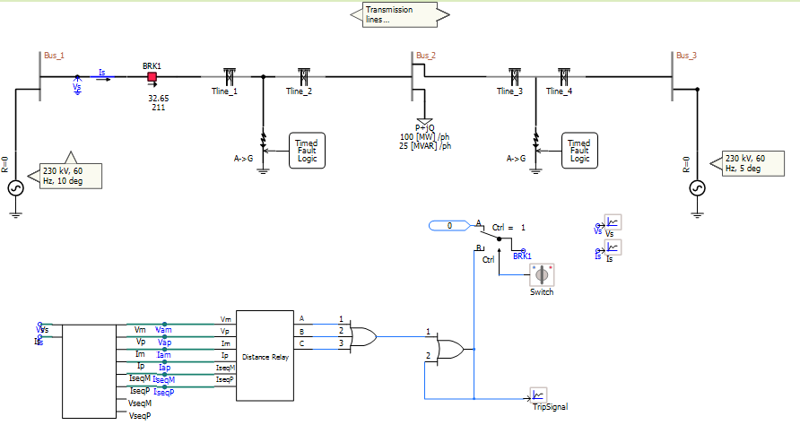
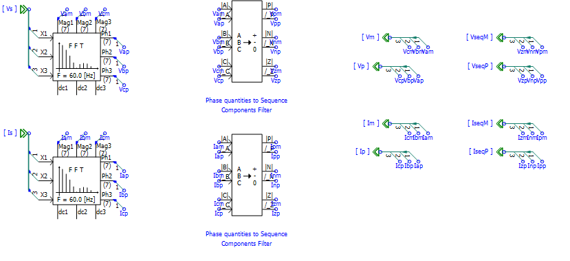
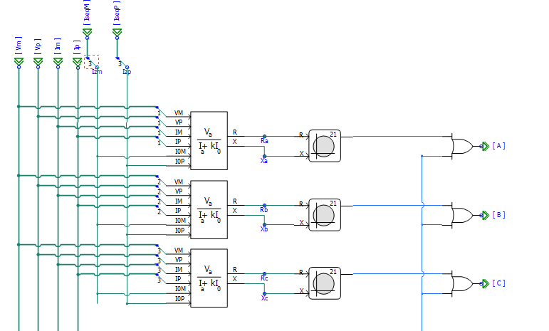
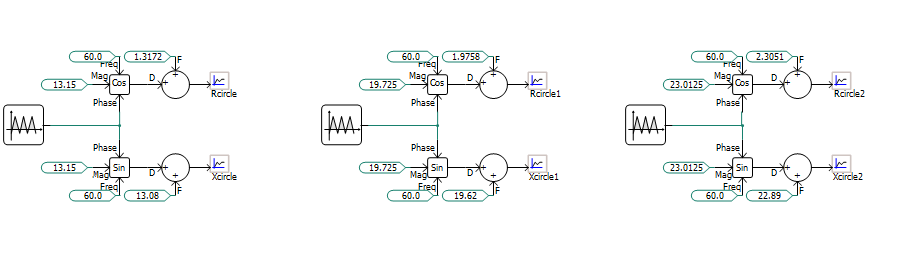
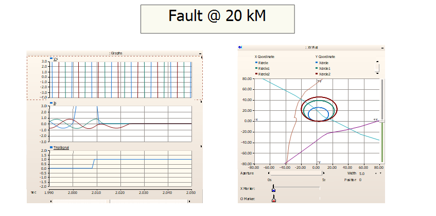
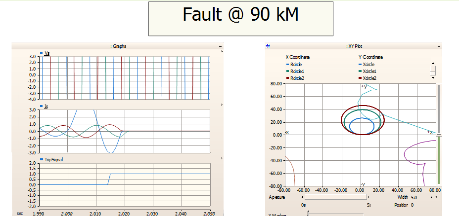
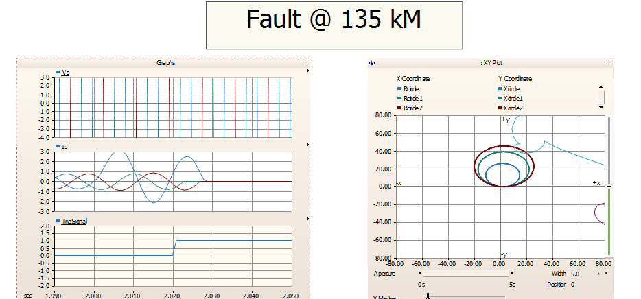
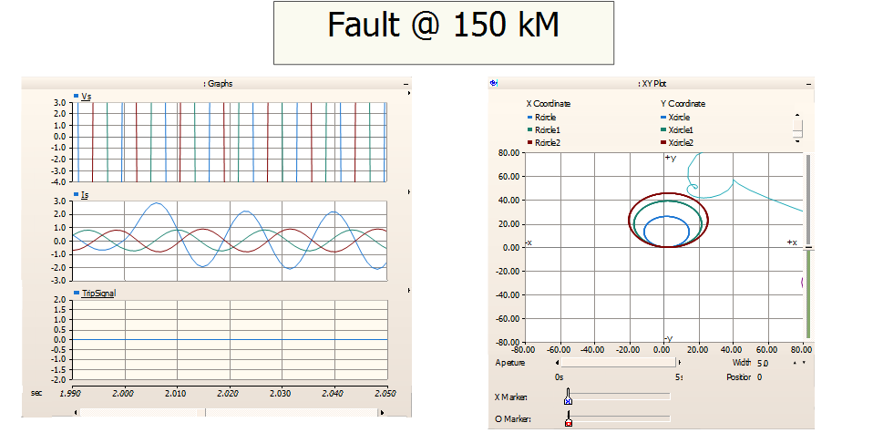

<body>
<i>Distance Relay</i>
</body>

  

This is a distance relay protection scheme in PSCAD. Four transmission line PSCAD functions are used to model two 100km transmission lines and simulate faults along the lines. Tline1+Tline2=100km and Tline3+Tline4=100km. To simulate a fault at 35km, Tline1 is set to 35 and Tline2 to 65, and the second fault is deactivated. 

Voltage, current, and tripping signals are displayed graphically. 

Shown below is the first block, the signal processor. Instantaneous voltage and current are captured via voltmeter and ammeter behind the breaker. Sequence and phase values are calculated for current and voltage magnitude and phase. This process involves the use of fourier transform to calculate voltage and current magnitude and phase. Phase to sequence filter is then used to calculate sequence values. Finally, the data is exported as arrays through the use of a data merge.

Phase and sequence values for current and voltage are then taken in by the distance relay function shown below, which taps the data arrays and feeds them into impedance calculators. In the example shown, a phase-to-ground fault is shown. Impedance values of the fault are compared to the total impedance of the line. If the impedance of the fault is less than the impedance of the "reach point", or zone limit, the breaker will be tripped. This comparison involves the use of a Mho circle, which outputs 1 if the fault occurs within zones 1-3, and 0 if it does not. 

The 1 or 0 value is finally exported from the distance relay block into the control switch where it will instruct the breaker to either remain deactivated or trip.

The mho circles are plotted graphically using signal and sin/cosine generators, as well as the impedance of the fault (shown below). The three circles represent the three protection zones. Zone 1 faults trigger an instantaneous trip, and zones 2 and 3 trigger a delayed trip. Zone 1 = 0-80km, Zone 2 = 80-120km, and Zone 3 = 120-140km. The radius of the circles are the total impedances of each zone. For example, resistance in ohm/km is 0.03293. This value is multiplied by 70 (140/2 for radius of circle) and input as one of the values for circle 3. Reactance is multiplied by 70 as well, and the root mean square of the two represents the impedance, which ends up being used as the value of the radius (23.0125).

Zone 3 contains zones 1 and 2, and so the mho circles compare fault impedance against only zone 3 to determine whether or not the breaker will trip. Only faults that lie outside of zone 3 will not trip.

The following examples show the graphical outputs of various phase-to-ground faults.

